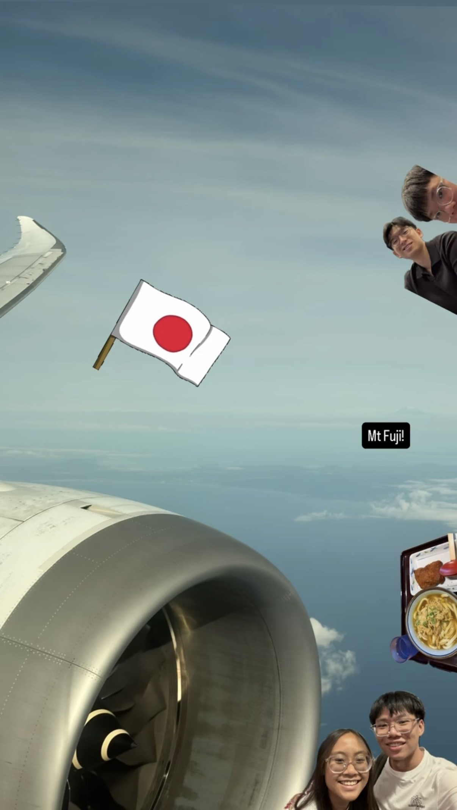
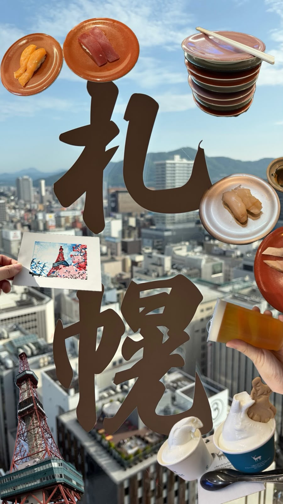
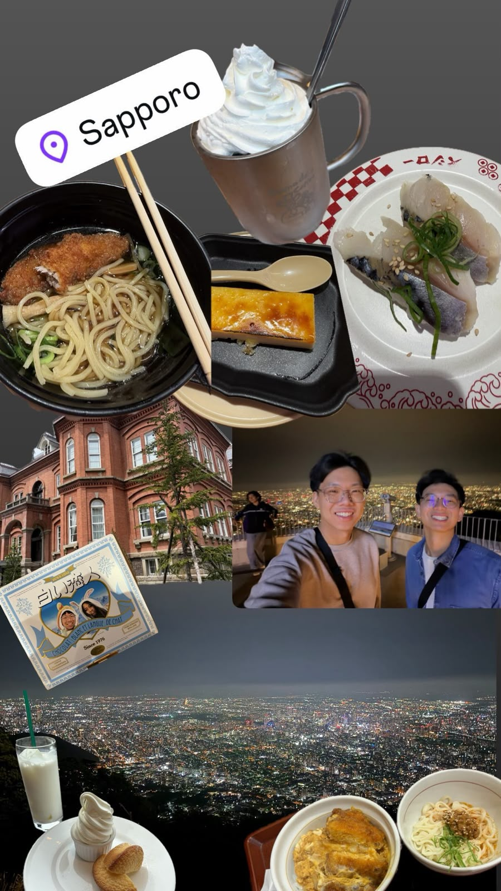
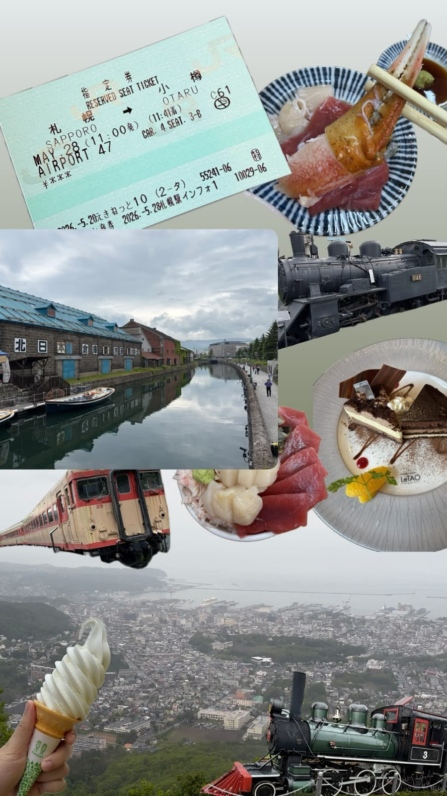
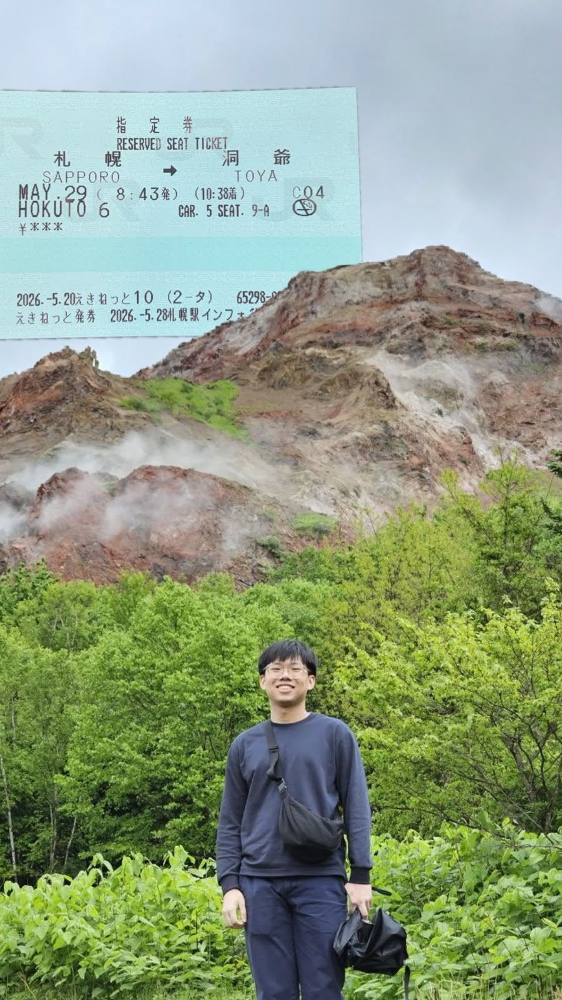
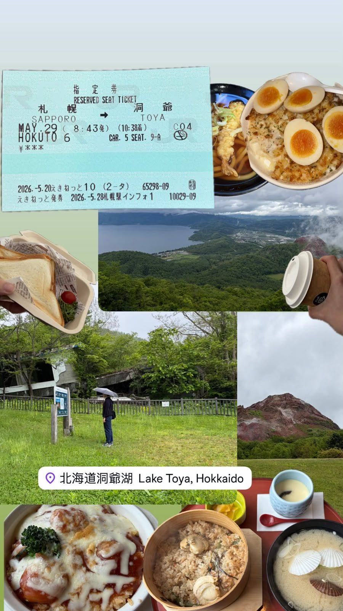
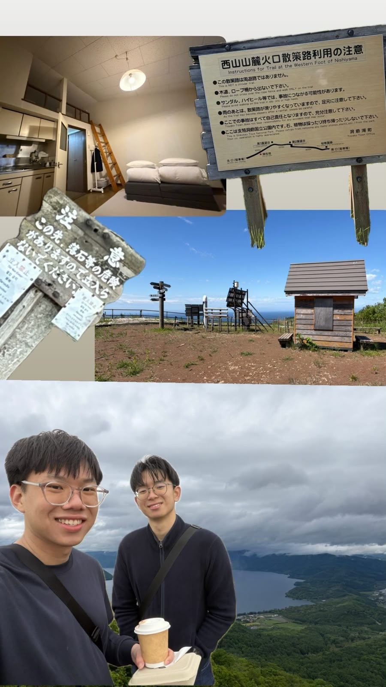
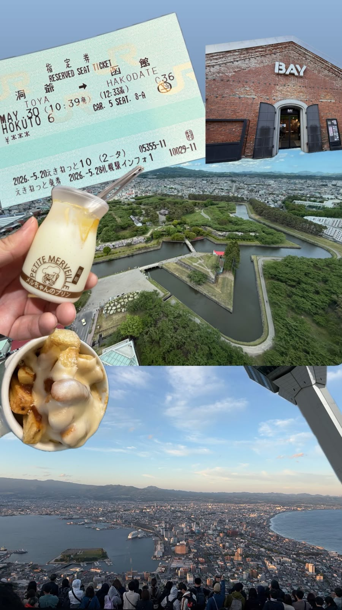
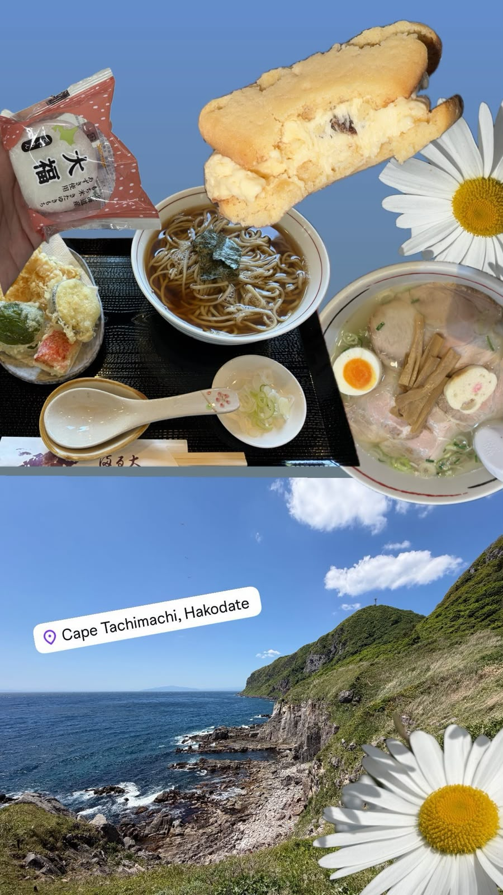
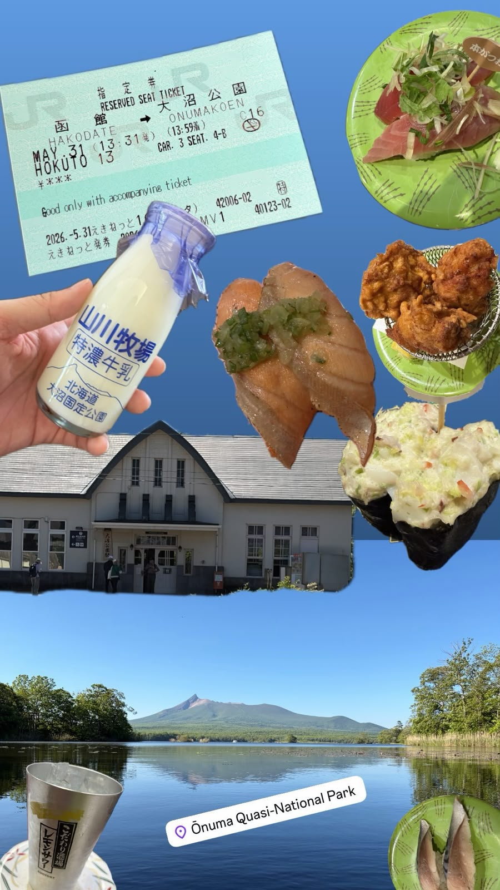

# Hokkaido Summer trip   (25 May - 9 June 2026)

#### Flight (Singapore -> Tokyo -> Sapporo)
{ width="300" }

#### Sapporo
{ width="300" }
{ width="300" }

#### Otaru
{ width="300" }

#### Toya
{ width="300" }
{ width="300" }
{ width="300" }

#### Hakodate
{ width="300" }
{ width="300" }

#### Onuma
{ width="300" }

